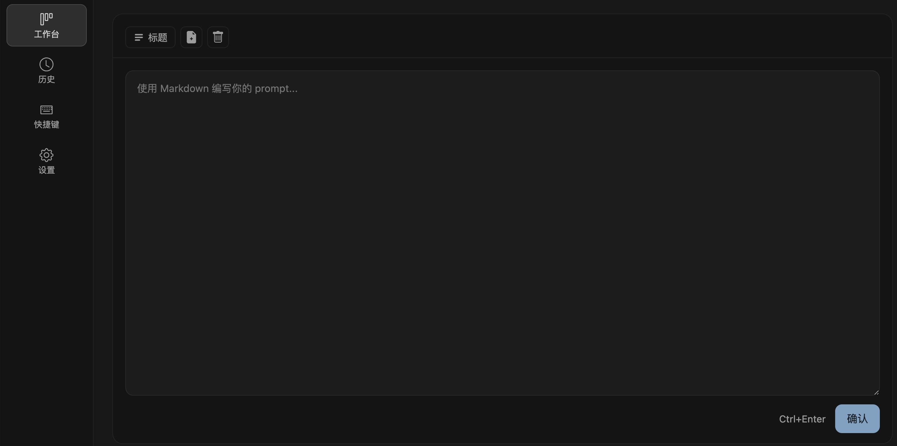
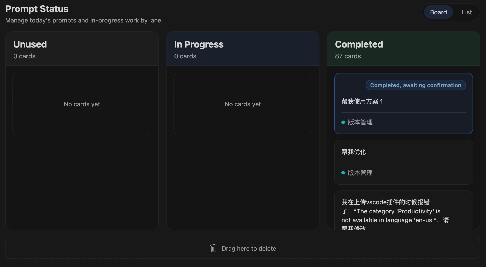
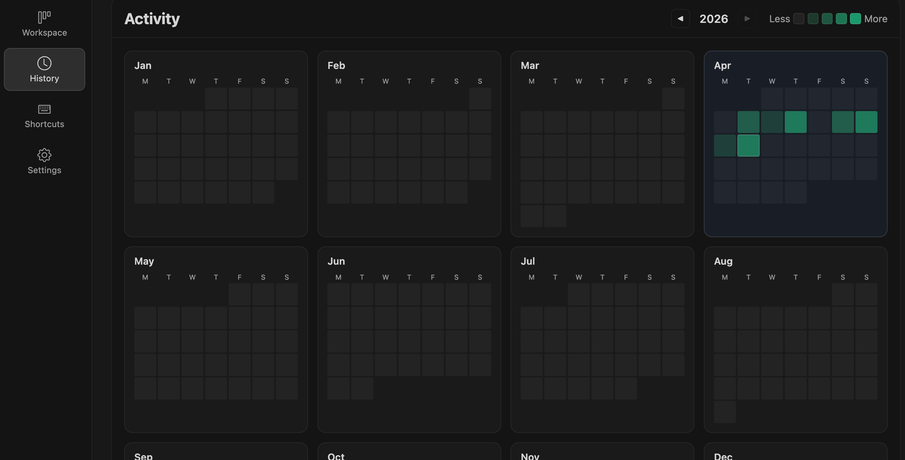

# Prompter

  <a href="./README.md"><strong>English</strong></a> | <a href="./README.zh-CN.md"><strong>简体中文</strong></a>

  

  A prompt workspace for VS Code that turns daily prompt writing into a reusable, trackable workflow.

  Compose prompts faster, copy them out with one click, track running work from Claude Code / Codex / Roo Code, and keep prompt history useful after the session ends.

Prompter is built for people who work with AI inside VS Code every day.

Instead of repeatedly copying code selections, file paths, terminal output, and half-finished prompt drafts by hand, Prompter gives you one productized workspace to prepare prompts, organize prompt cards, monitor external sessions, and review what happened later.

It works especially well for workflows built around Claude Code, Codex, Roo Code, Cursor, and any other AI tool that starts with a copied prompt.

## Table of Contents

- [Why Prompter](#why-prompter)
- [Highlights](#highlights)
- [Product Tour](#product-tour)
  - [Workspace Composer](#workspace-composer)
  - [Prompt Status](#prompt-status)
  - [History](#history)
  - [Shortcuts](#shortcuts)
  - [Settings](#settings)
- [External Session Sync](#external-session-sync)
- [Commands and Default Shortcuts](#commands-and-default-shortcuts)
- [Storage](#storage)
- [Local Development](#local-development)
- [Links](#links)

## Why Prompter

Prompt work is usually repetitive, fragmented, and easy to lose.

A typical coding workflow often looks like this:

- copy code into an AI chat
- manually add file paths
- paste terminal output by hand
- rebuild the same prompt structure again and again
- forget which prompt is still running
- lose useful prompts once the chat is over

Prompter brings that scattered work back into VS Code and turns it into a repeatable workflow.

## Highlights

- **Draft first, send later.** Write and refine prompts in a dedicated editor before pasting them into an external AI tool.
- **Save and copy in one step.** Confirming a prompt saves it as a card in `Unused` and copies it to the clipboard immediately.
- **Keep half-finished ideas.** Start a new blank draft without losing the current one.
- **Track prompt lifecycle visually.** Move cards across `Unused`, `In Progress`, and `Completed`, or let imported sessions update automatically.
- **Stay connected to external sessions.** Detect supported Claude Code, Codex, and Roo Code activity from logs and jump back to the source session.
- **Review prompt work like an activity feed.** Use a GitHub-style history view to revisit what you wrote and used.

## Product Tour

### Workspace Composer

The `Workspace` page is the place where prompt writing starts.

  

What you can do here:

- write prompts in Markdown inside a dedicated composer
- click **Confirm** to save the current prompt into `Unused` and copy it to the clipboard
- click the trash button to clear the current draft when you no longer need it
- click the new-page button to open a blank draft while preserving the current content in `Unused`
- import editor selections, Explorer resources, and terminal selections into the draft so context gathering stays fast
- keep prompt preparation inside VS Code instead of scattering it across chats and notes

This page is optimized for the moment before you send a prompt out.

### Prompt Status

Below the composer, Prompter shows a dedicated `Prompt Status` area for prompt cards.

  

What you can do here:

- view prompts in **Board** or **List** mode
- single-click a card to copy it again
- double-click a card to reopen it in the composer for editing
- drag cards across `Unused`, `In Progress`, and `Completed`
- drag a card into the delete zone to remove it quickly
- rename the group name shown on a card; imported prompts are grouped by session, so renaming the group updates that whole session group
- expand long prompt cards when the preview is too short
- jump directly from a card back to the matching Claude Code, Codex, or Roo Code session

Prompter also keeps imported running prompts visible. When a tracked prompt finishes, it can notify you, play a tone, and highlight the card until you acknowledge it.

### History

The `History` page turns prompt work into something you can actually review.

  

What you can do here:

- browse prompt activity with a GitHub-style heatmap
- click a specific day to inspect that day's prompts
- view prompts grouped by session so the history is easier to scan
- filter the selected day by `Unused`, `In Progress`, or `Completed`
- expand a prompt preview to read the full content
- copy historical prompts back into use
- inspect associated file references and line ranges for extra context

This page is especially useful when you want to understand what you tried, what got reused, and what finished on a given day.

### Shortcuts

The `Shortcuts` page gives Prompter its own built-in shortcut management UI.

What you can do here:

- review the current shortcut for each Prompter command
- record a new shortcut without editing `keybindings.json` by hand
- reset any command back to its default binding
- keep the main entry and all import actions easy to trigger from your normal workflow

Today the shortcut page focuses on four core actions:

- opening Prompter
- importing the current editor selection
- importing a selected file or folder from Explorer
- importing the current terminal selection

## Settings

The `Settings` page controls how Prompter behaves in day-to-day use.

What you can configure here:

- interface language
- theme mode
- default import path format
- prompt completion notifications
- completion tone, including a custom audio file path
- data directory
- log source paths and toggles for Claude Code, Codex, and Roo Code
- whether existing data should be migrated when switching data directories
- cache clearing for the local workspace state

This lets Prompter fit different environments, different log layouts, and different notification preferences.

## External Session Sync

Prompter can import supported prompt activity from external coding-agent logs.

Supported sources:

- Claude Code
- Codex
- Roo Code

Once log sync is enabled and the paths are configured in `Settings`, Prompter can:

- detect imported prompts from those sessions
- group them by session
- keep running prompts visible in the workspace
- mark prompts as completed when the source session finishes
- highlight freshly completed prompts until you acknowledge them
- open the matching external session again from the prompt card

This is what makes Prompter more than a local scratchpad. It becomes a control surface for prompts that continue running outside the editor.

## Commands and Default Shortcuts

| Command | Purpose | Default Shortcut |
| --- | --- | --- |
| `Prompter: Open` | Open the Prompter workspace | `Ctrl+E` |
| `Prompter: Open Shortcuts` | Open the built-in shortcuts page | None |
| `Prompter: Import Selection to Prompt` | Import the current editor selection | `Ctrl+Shift+F` |
| `Prompter: Add Resource to Prompt` | Import the selected Explorer file or folder | `Ctrl+Shift+F` |
| `Prompter: Import Terminal Selection` | Import the current terminal selection | `Ctrl+Shift+F` |

Notes:

- The three import commands intentionally share the same default shortcut because they run in different VS Code contexts.
- Prompter also adds an Activity Bar entry so the workspace stays easy to reopen.

## Storage

By default, Prompter stores data in `~/prompter`.

Main files include:

- `cards.json`
- `modular-prompts.json`
- `daily-stats.json`
- `settings.json`
- `session-groups.json`
- `modular-prompts.json`

## Links

- GitHub: <https://github.com/hzxwonder/Prompter>
- Chinese README: [README.zh-CN.md](./README.zh-CN.md)
- License: [LICENSE.md](./LICENSE.md)
